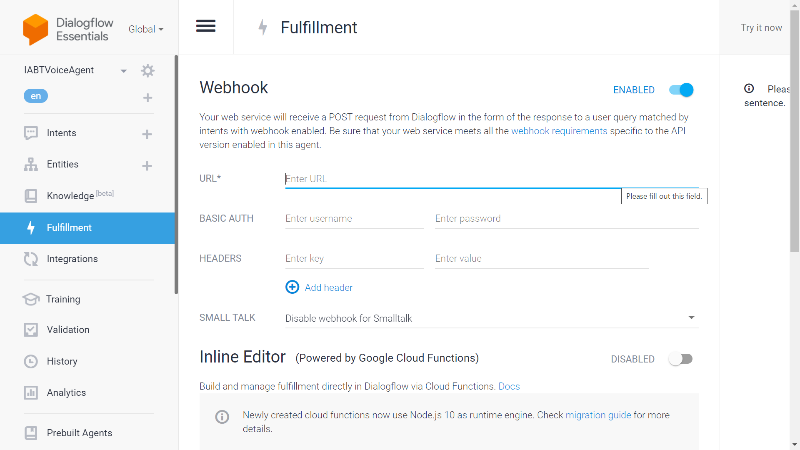

[]()
[]()

# How to enable voice commands in bkc-node

In order to enable voice commands via Alexa or Google Assistant for a node:

### Setting up your Webhook
The first step is to run this process on your node server
1. Download or clone the "iavoice" repo
2. Run it on the server by node or PM2
```sh
$ cd iavoice

$ node src/index.js
## Alternative
$ pm2 start src/index.js
```
3. Use one web server to listen to your webhook public address under 443
   `i.e. https://your.node.server:443/webhook_alexa`
4. Redirect it to port 4122, which is being listened to by this process

### Setting up Alexa
1. Create an Amazon developer account
2. Download schema definition file named <a href="assets/BKC-Alexa-Schema.json">BKC-Alexa-Schema.json</a> from git repository.
3. In the Alexa console go to "Json Editor" page and upload the json file by dragging and drop there.
4. Click on the button "Save Model"
5. Click on the button "Build Model"
6. Go to the Endpoint menu
7. Select "HTTPS"
8. In the "Default Region" box set your webhook URL `i.e. https://your.node.server:443/webhook_alexa`
9. In the "certificate" box select item "My development endpoint has a certificate from a trusted certificate authority"
10. Rest other boxes as default
11. Click the button "Save Endpoints"
    

### Setting up Google Assistant
1. Create an google developer account
2. Go to Dialogflow panel <a href="https://dialogflow.cloud.google.com/">here</a>
3. Create new "Agent"
4. Download <a href="assets/BKCVoiceAgent.zip">BKCVoiceAgent.zip</a> file
5. In Dialogflow go to settings and "Export and Import" tab
6. Upload the zip file using "RESTORE FROM ZIP" button
   
7. Go to "Fullfillment" menu and set your webhook address
   
8. Set "URL" by your webhook address `i.e. https://your.node.server:443/webhook`
9. Click "SAVE" button in the bottom of page
